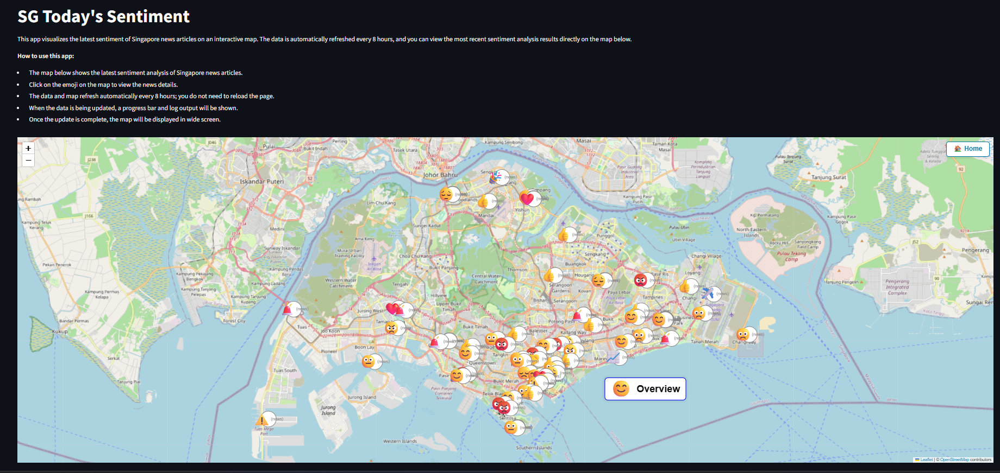

# Singapore News Happiness Index



This project is a fully automated pipeline that crawls Singapore news, performs Google Gemini-powered sentiment and location analysis, and visualizes the results as emoji markers on a Singapore map. The project is developed via Vibe Coding using GitHub Copilot on Visual Studio Code.

## Features
- **News Crawling**: Scrapes latest news from The Straits Times, Channel NewsAsia, Today Online, and Mothership.
- **Sentiment & Location Analysis**: Uses Google Gemini 2.0 Flash to analyze each article for sentiment (positive/negative/neutral), a reason, an emoji, and the most relevant Singapore location. If the article does not mention Singapore, Gemini is also asked if the article is Singapore-related.
- **Geocoding**: Dynamically geocodes locations using OneMap.sg (primary) and Nominatim (fallback).
- **Visualization**: Displays emoji markers on a Folium map of Singapore, with popups showing news source, title, sentiment, reason, emoji, and a clickable article URL. Overlapping markers are automatically separated for clarity.
- **Summary Table**: Shows an overall sentiment marker with a summary table of sentiment counts per news outlet, subtotals, total, and last updated timestamp.
- **Home Button**: A Home button reloads the map to its initial state.
- **Caching**: All Gemini results are cached in `processed_articles.json` to avoid redundant API calls.
- **Efficient Pipeline**: Only new articles are processed by Gemini; previously processed articles are loaded from cache.
- **Token Usage Tracking**: Prints Gemini API in/out/total token usage for every call.
- **.env Security**: API keys are loaded from `.env` and never pushed to GitHub.
- **Error Handling**: Robust error handling for crawling, Gemini API, and geocoding.

## Project Structure
- `news_crawler.py` — News crawling logic
- `sentiment_analysis.py` — (Legacy/optional) Sentiment analysis helpers
- `map_visualization.py` — Map generation and visualization
- `scheduler.py` — (Optional) For scheduled/automated runs
- `run_pipeline.py` — Main entry point to run the full pipeline
- `requirements.txt` — All Python dependencies
- `.env` — Stores Gemini API key (never push to GitHub)
- `articles_with_sentiment.json` — All articles with basic sentiment
- `processed_articles.json` — Cache of Gemini results
- `singapore_news_sentiment_map.html` — Output map

## Setup & Usage
1. **Install dependencies**:
   ```sh
   pip install -r requirements.txt
   ```
2. **Add your Gemini API key** to `.env`:
   ```env
   GEMINI_API_KEY="your_google_gemini_api_key_here"
   ```
3. **Run the pipeline**:
   ```sh
   python run_pipeline.py
   ```
4. **Open `singapore_news_sentiment_map.html`** in your browser to view the map.

## Requirements
See `requirements.txt` for all dependencies. Major packages:
- requests
- beautifulsoup4
- textblob
- folium
- feedparser
- selenium
- webdriver-manager
- python-dotenv
- branca

## Notes
- Only today's news is visualized on the map.
- The Home button reloads the map to its initial state.
- Gemini API is only called for new articles; all results are cached.
- `.env` and API keys are never pushed to GitHub (see `.gitignore`).
- If the article does not mention Singapore, Gemini is asked if it is Singapore-related and only such articles are visualized.
- Gemini API token usage is printed for every call.
- **To perform a completely new run (clear all Gemini cache and reprocess all articles), delete `processed_articles.json` before running the pipeline.**

---

*For any issues or suggestions, please open an issue or PR on your repository.*
